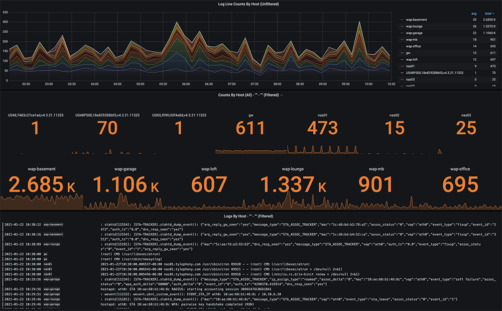
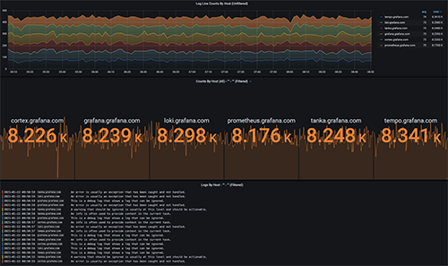

# grafana-loki-syslog-aio-prometheus-cadvisor-prometheus-promtail

# 🚀 Grafana Loki Syslog All In One Syslog Deployable Stack 🚀

https://github.com/coding-to-music/grafana-loki-syslog-aio-prometheus-cadvisor-prometheus-promtail

From / By Dave Schmid https://github.com/lux4rd0/grafana-loki-syslog-aio

https://github.com/lux4rd0/grafana-loki-syslog-aio

https://labs.lux4rd0.com/2021/01/oldskool-syslog-meets-newskool-loki/

## Environment variables:

```java

```

## GitHub

```java
git init
git add .
git remote remove origin
git commit -m "first commit"
git branch -M main
git remote add origin git@github.com:coding-to-music/grafana-loki-syslog-aio-prometheus-cadvisor-prometheus-promtail.git
git push -u origin main
```

## Scrape Configs

```
scrape_configs:

  - job_name: 'prometheus'
    static_configs:
    - targets: ['prometheus:9090']

  - job_name: 'grafana'
    static_configs:
    - targets: ['grafana:3000']

  - job_name: 'loki'
    static_configs:
    - targets: ['loki:3100']

  - job_name: 'promtail'
    static_configs:
    - targets: ['promtail:9080']

  - job_name: 'minio'
    metrics_path: /minio/prometheus/metrics
    static_configs:
    - targets: ['minio:9000']

  - job_name: 'node'
    static_configs:
    - targets: ['node-exporter:9100']

  - job_name: 'caadvisor'
    static_configs:
    - targets: ['cadvisor:8080']
```

## Results

Grafana http://localhost:3000/?orgId=1&refresh=30s

http://127.0.0.1:9000/

http://127.0.0.1:42295/

alertmanager_url: http://localhost:9093

## Running

This docker compose file works very well:

Example Stack without MinIO, monitoring, or Syslog generator: Grafana, Loki with the filesystem, Promtail, syslog-ng

```
docker-compose -f ./docker-compose-filesystem.yml up
```

Default docker-compose.yml has many errors, perhaps due to minio? no idea...

```
docker compose up
```

Output

```
syslog-ng      | [2022-08-01T21:56:11.439768] WARNING: Configuration file format is too old, syslog-ng is running in compatibility mode. Please update it to use the syslog-ng 3.37 format at your time of convenience. To upgrade the configuration, please review the warnings about incompatible changes printed by syslog-ng, and once completed change the @version header at the top of the configuration file; config-version='3.29'

syslog-ng      | [2022-08-01T21:56:11.453262] Included file was skipped because of a missing module; module='mod-java', location='/usr/share/syslog-ng/include/scl/kafka/kafka-java.conf:24:1'

syslog-ng      | [2022-08-01T22:02:11.656218] Control command thread has started; control_command='STATS'
syslog-ng      | [2022-08-01T22:02:11.656472] Control command thread is exiting now; control_command='STATS'
syslog-ng      | [2022-08-01T22:02:11.657271] EOF on control channel, closing connection;

loki           | level=warn ts=2022-08-02T04:37:19.78273063Z caller=store.go:51 msg="running with DEPRECATED flag -store.max-look-back-period, use -querier.max-query-lookback instead."
loki           | level=info ts=2022-08-02T04:37:19.784862418Z caller=main.go:103 msg="Starting Loki" version="(version=2.6.1, branch=HEAD, revision=6bd05c9a4)"
loki           | level=info ts=2022-08-02T04:37:19.786285498Z caller=server.go:288 http=[::]:3100 grpc=[::]:9095 msg="server listening on addresses"
loki           | level=warn ts=2022-08-02T04:37:19.7873903Z caller=experimental.go:20 msg="experimental feature in use" feature="In-memory (FIFO) cache - frontend.fifocache"
loki           | level=warn ts=2022-08-02T04:37:19.788164236Z caller=fifo_cache.go:112 msg="running with DEPRECATED flag fifocache.size, use fifocache.max-size-items or fifocache.max-size-bytes instead" cache=frontend.fifocache
loki           | level=warn ts=2022-08-02T04:37:19.788803279Z caller=fifo_cache.go:125 msg="running with DEPRECATED flag fifocache.interval, use fifocache.ttl instead" cache=frontend.fifocache

loki           | creating WAL folder at "/wal": mkdir wal: permission denied
loki           | error initialising module: ingester
loki           | github.com/grafana/dskit/modules.(*Manager).initModule
loki           |        /src/loki/vendor/github.com/grafana/dskit/modules/modules.go:122
loki           | github.com/grafana/dskit/modules.(*Manager).InitModuleServices
loki           |        /src/loki/vendor/github.com/grafana/dskit/modules/modules.go:92
loki           | github.com/grafana/loki/pkg/loki.(*Loki).Run
loki           |        /src/loki/pkg/loki/loki.go:341
loki           | main.main
loki           |        /src/loki/cmd/loki/main.go:105
loki           | runtime.main
loki           |        /usr/local/go/src/runtime/proc.go:255
loki           | runtime.goexit
loki           |        /usr/local/go/src/runtime/asm_amd64.s:1581
loki           | level=info ts=2022-08-02T04:38:20.35188637Z caller=table_manager.go:134 msg="uploading tables"
loki           | level=info ts=2022-08-02T04:38:20.351965384Z caller=table_manager.go:167 msg="handing over indexes to shipper"
loki           | level=error ts=2022-08-02T04:38:20.352197105Z caller=log.go:103 msg="error running loki" err="creating WAL folder at \"/wal\": mkdir wal: permission denied\nerror initialising module: ingester\ngithub.com/grafana/dskit/modules.(*Manager).initModule\n\t/src/loki/vendor/github.com/grafana/dskit/modules/modules.go:122\ngithub.com/grafana/dskit/modules.(*Manager).InitModuleServices\n\t/src/loki/vendor/github.com/grafana/dskit/modules/modules.go:92\ngithub.com/grafana/loki/pkg/loki.(*Loki).Run\n\t/src/loki/pkg/loki/loki.go:341\nmain.main\n\t/src/loki/cmd/loki/main.go:105\nruntime.main\n\t/usr/local/go/src/runtime/proc.go:255\nruntime.goexit\n\t/usr/local/go/src/runtime/asm_amd64.s:1581"
```

## grafana-loki-syslog-aio


## About The Project

This Loki Syslog All-In-One example is geared to help you get up and running quickly with a Syslog ingestor and visualization of logs. It uses [Grafana Loki](https://grafana.com/oss/loki/) and Promtail as a receiver for forwarded syslog-ng logs. I wrote an [introductory blog post](https://labs.lux4rd0.com/2021/01/oldskool-syslog-meets-newskool-loki/) about how this AIO project came about as well (pesky intermittent network issues!!)



_Note that this All In One is geared towards getting network traffic from legacy syslog (RFC3164 UDP port 514) into Loki via [syslog-ng](https://www.syslog-ng.com/) and [Promtail](https://grafana.com/docs/loki/latest/clients/promtail/)._

Essentially:

> RFC3164 Network/Compute Devices -> syslog-ng (UDP port 514) ->
> Promtail (port 1514) -> Loki (port 3100) <- Grafana (port 3000)

## Getting Started

The project is built around a pre-configured Docker stack of the following:

- [Grafana](https://grafana.com/oss/grafana/)
- [Grafana Loki](https://grafana.com/oss/loki/) (configured for [MinIO](https://min.io/))
- [Grafana Promtail](https://grafana.com/docs/loki/latest/clients/promtail/)
- [syslog-ng](https://www.syslog-ng.com/)

The stack has been extended to include pre-configured monitoring with:

- [Prometheus](https://grafana.com/oss/prometheus/)
- [Node-Exporter](https://github.com/prometheus/node_exporter)
- [cAdvisor](https://github.com/google/cadvisor)

A simple Syslog generator is included based on Vicente Zepeda Mas's [random-logger](https://github.com/chentex/random-logger) project.

## Prerequisites

- [Docker](https://docs.docker.com/install)
- [Docker Compose](https://docs.docker.com/compose/install)

## Using

This project is built and tested on Linux CentOS 7. To get started, download the code from this repository and extract it into an empty directory. For example:

    wget https://github.com/lux4rd0/grafana-loki-syslog-aio/archive/main.zip
    unzip main.zip
    cd grafana-loki-syslog-aio-main

From that directory, run the docker-compose command:

**Full Example Stack:** Grafana, Loki with s3/MinIO, Promtail, syslog-ng, Prometheus, cAdvisor, node-exporter

    docker-compose -f ./docker-compose.yml up -d

This will start to download all of the needed application containers and start them up.

_(Optional docker-compose configurations are listed under **Options** below)_

**Grafana Dashboards**

Once all of the docker containers are started up, point your Web browser to the Grafana page, typically http://hostname:3000/ - with hostname being the name of the server you ran the docker-compose up -d command on. The "Loki Syslog AIO - Overview" dashboard is defaulted without having to log in.

_Note: this docker-compose stack is designed to be as easy as possible to deploy and go. Logins have been disabled, and the default user has an admin role. This can be changed to an Editor or Viewer role by changing the Grafana environmental variable in the docker-compose.yml file to:_

    GF_AUTH_ANONYMOUS_ORG_ROLE: Viewer

**Getting Started With Loki**

Here are some additional resources you might find helpful if you're just getting started with Loki:

- [Getting started with Grafana and Loki in under 4
  minutes](https://grafana.com/go/webinar/loki-getting-started/)
- [An (only slightly technical) introduction to Loki](https://grafana.com/blog/2020/05/12/an-only-slightly-technical-introduction-to-loki-the-prometheus-inspired-open-source-logging-system/)
- [Video tutorial: Effective troubleshooting queries with Grafana
  Loki](https://grafana.com/blog/2021/01/07/video-tutorial-effective-troubleshooting-queries-with-grafana-loki/)

## Stack Options:

A few other docker-compose files are also available:

**Full Example Stack with Syslog Generator:** Grafana, Loki with s3/MinIO, Promtail, syslog-ng, Prometheus, cAdvisor, node-exporter, Syslog Generator

    docker-compose -f ./docker-compose-with-generator.yml up -d

**Example Stack without monitoring or Syslog generator**: Grafana, Loki with s3/MinIO, Promtail, syslog-ng

    docker-compose -f ./docker-compose-without-monitoring.yml up -d

**Example Stack without MinIO, monitoring, or Syslog generator:** Grafana, Loki with the filesystem, Promtail, syslog-ng

    docker-compose -f ./docker-compose-filesystem.yml up -d

The _Syslog Generator_ configuration will need access to the Internet to do a local docker build from the configurations location in ./generator. It'll provide some named hosts and random INFO, WARN, DEBUG, ERROR logs sent over to syslog-ng/Loki.



## Configuration Review:

The default Loki storage configuration docker-compose.yml uses S3 storage with MinIO. If you want to use the filesystem instead, use the different docker-compose configurations listed above or change the configuration directly. An example would be:

    volumes:
    - ./config/loki-config-filesystem.ym:/etc/loki/loki-config.yml:ro

**Changing MinIO Keys**

The MinIO configurations default the Access Key and Secret Key at startup. If you want to change them, you'll need to update two files:

./docker-compose.yml

      MINIO_ACCESS_KEY: minio123
      MINIO_SECRET_KEY: minio456

./config/loki-config-s3.yml

     aws:
      s3: s3://minio123:minio456@minio.:9000/loki

## Changed Default Configurations In syslog-ng and Promtail

To set this example All In One project up, the following configurations have been added to the docker-compose.yml. If you already have syslog-ng running on your deployment server - make similar changes below and comment out the docker container stanza.

#### SYSLOG-NG CONFIGURATION (docker container listens on port 514)

**# syslog-ng.conf**

    source s_local {
        internal();
    };

    source s_network {
        default-network-drivers(
        );
    };

    destination d_loki {
        syslog("promtail" transport("tcp") port("1514"));
    };

    log {
            source(s_local);
            source(s_network);
            destination(d_loki);
    };

> Note: the above "`promtail`" configuration for `destination d_loki` is
> the _hostname_ where Promtail is running. Is this example, it happens
> to be the Promtail _docker container_ name that I configured for the
> All-In-One example.

#### PROMTAIL CONFIGURATION (docker container listens on port 1514)

**# promtail-config.yml**

    server:
      http_listen_port: 9080
      grpc_listen_port: 0

    positions:
      filename: /tmp/positions.yaml

    clients:
      - url: http://loki:3100/loki/api/v1/push

    scrape_configs:

    - job_name: syslog
      syslog:
        listen_address: 0.0.0.0:1514
        idle_timeout: 60s
        label_structured_data: yes
        labels:
          job: "syslog"
      relabel_configs:
        - source_labels: ['__syslog_message_hostname']
          target_label: 'host'

## Contributing

Contributions make the open source community such a fantastic place to learn, inspire, and create. Any contributions you make are greatly appreciated.

- Fork the Project
- Create your Feature Branch (git checkout -b feature/AmazingFeature)
- Commit your Changes (git commit -m 'Add some AmazingFeature')
- Push to the Branch (git push origin feature/AmazingFeature)
- Open a Pull Request

## Contact

Dave Schmid - [@lux4rd0](https://twitter.com/lux4rd0) - dave@pulpfree.org

Project Link: https://github.com/lux4rd0/grafana-loki-syslog-aio

## Acknowledgements

- Grafana Labs - https://grafana.com/
- Grafana Loki - https://grafana.com/oss/loki/
- Grafana - https://grafana.com/oss/grafana/
- syslog-ng - https://www.syslog-ng.com/
- Random Logger - https://github.com/chentex/random-logger
- Grafana Dashboard Community (Performance Overviews) - https://grafana.com/grafana/dashboards
